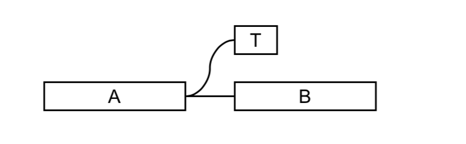

算法设计Project：宏基因组组装 实验报告
===
> 15307130140 万俊鹏

一、实验方法
---

#####1. 将基因序列构建成De brujin图(以下简称DBG)
#####2. 进行错误处理(bubbles, tips, 螺旋序列)
#####3. 在De brujin中寻找长单链

二、实验原理及步骤
---
### 1.构建De brujin图
 + DBG图   
    -  

    - 特点: 如果两个节点之间有一条有向边，则第一个节点序列后端（除首字符）与第二个节点序列的前端（除尾字符）相同

 + 读取所有的reads, 按顺序打碎成k-mer，插入DBG中
 + DBG每个节点(node)属性:
      - kmer: DNA序列，k-mer（string）
      - parents: 存储所有父节点的指针（vector）
      - children:存储所有子节点的指针（vector）
      - length: 从本节点出发，能寻找到的长度最长的DNA序列的长度
      - coverage: 此节点经过的次数
      - flag : 标记此节点的状态
 + 插入节点: 
    - 维护一个集合(C++中set，使用红黑树实现), 标记每个k-mer是否已经插入到图中。
    - 对于新k-mer,建立DBG的新节点, 其前k-mer为其父节点
    - 对于插入到图中的kmer，将前k-mer作为其父节点
    - 每插入或更新一个节点，递归更新父节点的length属性
 + 将两个short reads文件中的所有序列及反向互补序列作为DBG原料
 + 所有节点的指针存放在一个向量中维护
 
### 2.错误处理 -- bubbles, tips
#####A: bubble
######产生原因
 + 测序结果的每个碱基会在k-1个连续k-mer中出现，k为k-mer大小
 + 每有一个碱基出错，这k-1个连续的碱基会偏离在原来DBG图中出现的路径，形成一小段序列，并最终合并到原序列中。
 
  
#####B: tip
######产生原因：
 + 测序结果的每个碱基会在k-1个连续k-mer中出现，k为k-mer大小
 + 每有一个碱基出错，这k-1个连续的碱基会偏离在原来DBG图中出现的路径，形成一小段序列，如果错误出现在某个read的末端，则没有机会合并到原序列中，形成游离的尾端
 


#####C: bubble与tip特点
+ 长度不超过k
+ 覆盖率很低
+ 与对应正常节点相差一个碱基   


#####D 解决方法-合并分支
+ 遍历所有节点
+ 若节点NODE有两个及以上子节点，则对每对子节点：
    - 判断相似度，若相似度很高，则有一个节点在bubble或tip中
    - 判断两个节点的coverage，较小的一个节点在bubble或tips上，将其合并到正常节点中，标记为出错节点
    - 合并节点时，将两个节点的coverage相加
    - 直到合并为一个节点或者剩余节点相似度很低时，停止合并
+ 相似度判断方法：
    + 查看两个节点的kmer对应位置不相同碱基个数，不相同碱基个数越多，相似度越低
    + 原因：根据tips和bubbles的特点，与其对应的正常节点往往只相差一个碱基

<br>
<br>
<br>
<br>
<br>

### 3.repeats解螺旋

#####方法A
+ 查看节点的coverage，若大于阈值COVERAGE(测序重复次数*1.7), 则将此节点拆分
+ 拆分方法：
    - 对每个父节点，复制节点一次得到新节点，新复制的节点同此节点建立唯一的对应关系
    - 每个新节点的COVERAGE继承其父节点的COVERAGE。
    - 如果有多个子节点，则将父节按coverage排序，将每个子节点与其coverage最接近的分支相连
    - 如果只有一个子节点，对子节点进行递归解旋
    
#####方法B
+ 在寻找路径节点时，对于coverage明显高于序列平均覆盖率的节点，只降低coverage，不删除节点。直到coverage与覆盖率差不多的时，经过此节点时，将其删除。
+ 由于不能将分支一一对应，所以最终实现后这种方法效果较差，最终采用了方法A


### 4.输出路径
######A  方法一：寻找最大的非分支的路径

+ 寻找所有不为1-入度1-出度的顶点，从这些节点出发，遇到分支或端点便停止搜索。获得一个片段，并将其从图中删除
+ 剩余的节点只可能是独立的环，将这些环展开成一个路径，获得一个片段。
+ 将所有片段转化成DNA单链输出

+ 伪代码(参考网址：https://stepik.org/lesson/6207/step/1?unit=8254)
```
    MaximalNonBranchingPaths(Graph)
        Paths ← empty list
        for each node v in Graph
            if v is not a 1-in-1-out node
                if out(v) > 0
                    for each outgoing edge (v, w) from v
                        NonBranchingPath ← the path consisting of the single edge (v, w)
                        while w is a 1-in-1-out node
                            extend NonBranchingPath by the outgoing edge (w, u) from w 
                            w ← u
                        add NonBranchingPath to the set Paths
        for each isolated cycle in Graph
            add Cycle to Paths
        return Paths
```


<br>
<br>
<br>
<br>
<br>
<br>
<br>
<br>
###### B  方法二：按深度依次输出路径
+ 使用C++数据结构map存放节点，自定义键值比较函数，利用其红黑树的性质，使其按照length排序
+ 当map非空：
    - 从length最大的节点开始寻找一条最长路径
    - 将所有经过的路径节点从DBG图中删除
    - 每删除一个节点，递归更新其父节点的length，并调整其在map中存储的位置
+ 将所有片段转化成DNA单链输出

###### C 两种方法的比较
+ 方法一能够输出错误率很低的基因序列片段，但输出基因序列长度较低
+ 方法二虽然错误率略高，但能输出较长片段
+ 最终提交结果采用了方法二


三、最终实验结果
---
#### 1.data1
+ Genome_Fraction(%): 99.772
+ Duplication ratio: 1.833
+ NGA50: 9123.2
+ Misassemblies: 1.0
+ Mismatches per 100kbp:  94.242


#### 2.data2
+ Genome_Fraction(%): 99.86
+ Duplication ratio: 1.8818
+ NGA50: 7198.2
+ Misassemblies: 1.0
+ Mismatches per 100kbp: 0


#### 3.data3
+ Genome_Fraction(%): 98.23
+ Duplication ratio: 1.9608
+ NGA50: 6406.6
+ Misassemblies: 0.0
+ Mismatches per 100kbp: 0


#### 4.data4
+ Genome_Fraction(%): 97.017
+ Duplication ratio: 1.955
+ NGA50: 15153.8
+ Misassemblies: 7.0
+ Mismatches per 100kbp: 0


#### 5.结果分析
  + Duplication ratio一直在2.0左右，原因是构建DBG图时，将每个genome和其反向互补序列同时输出。
  + 对于data3~data4,拼出的平均长度较短(NGA50较低)
  + 后续改进方案：
    * 建立节点时，将反向互补序列建立在一个节点，重复率可以大大降低
    * 应使用pair-end连接拼接好的序列，提高平均长度

四、代码说明
---
#### A C++代码: data1~data4的解决方案
   + configs.h: 定义data1~data4会使用到的宏变量
   + basic_functions.h: 基本函数，如输入输出，取反向互补序列等
   + node.h: 定义DBG图节点及其操作
   + dbg.h: 定义DBG图的各种操作函数
   + main.cpp: 主函数

#### B  python代码：data1解决方案
>说明：由于最开始完成data1时，构建DBG图并没有很好的架构，导致处理测序错误时，程序冗长且很难维护。
因此完成剩余任务时，使用C++重构了代码(A部分) 

   +  basic_functions.py :基本函数，如输入输出，取反向互补序列等
   +  dbg.py: 定义DBG图及各种操作
   +  data1.py: 使用以上两个问题，解决data1

#### C 实验环境
+ C++: Xcode Version 9.4.1 (9F2000)
+ python: python3.6
+ 代码测试时，需要将data1~data4放到当前目录

<br>
<br>
<br>
<br>
<br>
<br>
<br>
<br>

五、参考资料
---
1. [cousera慕课: Genome Sequencing (Bioinformatics II)第二周](https://www.coursera.org/learn/genome-sequencing/home/welcome)
2. [cousera慕课：DNA序列组装](https://www.coursera.org/learn/dna-sequencing/home/week/3)
3. [cousera慕课：离散数学](https://www.coursera.org/learn/discrete-mathematics-ch/home/welcome)
4. 《一种DNA测序纠错算法》,郑纬民, 张 华, 王小川 (ISSN 1000-9825, CODEN RUXUEW
Journal of Software, Vol.17, No.2, February 2006, pp.193−199)
5. [基于WGS和CBC测序策略的DNA序列拼接算法研究](https://blog.csdn.net/zhanghu1228/article/details/402990)
6. [简单DNA序列组装（非循环子图)](http://www.cnblogs.com/zxzhu/p/7979157.html)
7. [DNA序列组装（贪婪算法）](http://www.cnblogs.com/zxzhu/p/7979097.html)
8. [Hybrid error correction and de novo assembly of single-molecule sequencing reads](https://www.nature.com/articles/nbt.2280)
9. [单分子测序reads（PB）的混合纠错和denovo组装](http://www.cnblogs.com/leezx/p/6067845.html)
10. [每日一生信--序列组装的算法k-mer ](http://blog.sina.com.cn/s/blog_670445240101kaba.html)
11. [基因组组装算法](http://www.docin.com/p-960561793.html)
12. 感谢尚红泽同学，提供了：
     + 处理bubbles与tips时合并节点的实现思路
     + De brujin图C语言实现，定义节点的方法

